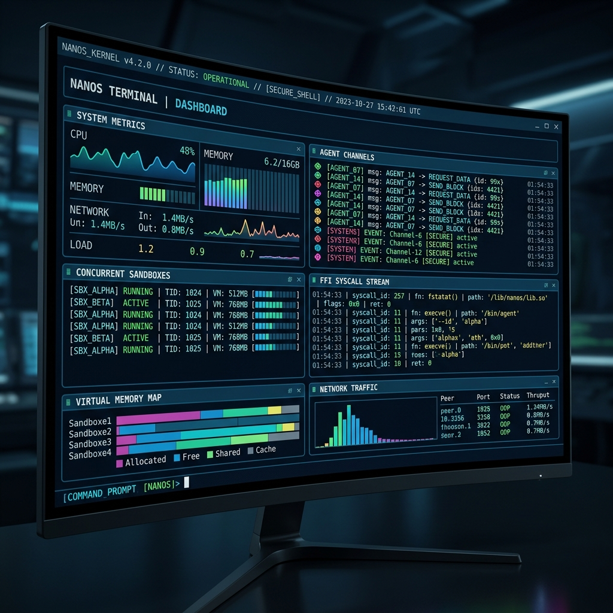

<div align="center">
  
  <h1>⚡ nanos</h1>
  <p><b>The lightweight, secure, and ultra-fast WebAssembly micro-runtime for sandboxed AI agents.</b></p>

  <p>
    <a href="https://github.com/PandiaJason/nanos/actions"></a>
    <a href="https://webassembly.org/"></a>
    
    
    <a href="LICENSE"></a>
  </p>

  <h3>📉 50x RAM Reduction (~39MB RSS vs 2GB+ VM) · ⚡ &lt; 3ms Sandbox Boot · Zero Docker · Zero Python</h3>
  <p><b>Just the agent, the weights, and the silicon. Serving WASM-sandboxed agents via CLI, HTTP API, TUI, or Web Debugger.</b></p>
</div>

---

## 💡 What is nanos?

**nanos** is a Rust-native, WebAssembly-powered micro-runtime for AI agents. By executing compiled agent binaries inside a hardware-isolated WebAssembly sandbox (Wasmtime), it cuts the typical runtime RAM footprint from **2GB+ (Docker Desktop VM on macOS) to ~39MB**, while booting the VM in **< 3ms**. 

Rather than deploying agents as bloated virtual machines that talk to tools over HTTP, `nanos` executes tool calls via direct, in-memory **Foreign Function Interface (FFI) pointer passing**. The host and the agent share a zero-copy memory boundary, eliminating JSON serialization latency and local TCP socket overhead.

---

## 🚨 The Problem with Current Agent Stacks

Every AI agent framework today suffers from massive latency, memory bloat, and security vulnerabilities. A typical stack looks like this:

> `Docker (200MB) → Python (2s boot) → pip install langchain (500MB) → MCP server (HTTP daemon) → LLM API (TCP socket, JSON serialize, wait, parse)`

Every arrow represents latency, memory consumption, and a larger attack surface. 

**nanos** throws out the entire stack:

> `nanos run agent.nano → WASM sandbox boots (< 50ms) → weights memory-mapped to GPU → tool calls via FFI pointer pass (zero copy) → done.`

One binary. One process. No network. No serialization tax.

<p align="center">
  
</p>

---

## ✨ Features

*   **🔐 Hardware-Isolated WASM Sandbox**: Every agent runs inside a strict, metered `wasmtime` store with WASM linear memory isolation, fuel limits to prevent infinite loops, and strict memory caps.
*   **🎮 Native Metal & CUDA GPU Offload**: Model weights are memory-mapped directly onto Apple Metal or Linux CUDA graphics hardware via native `llama.cpp` layers (`--features gpu-cuda`).
*   **🤖 Multi-Agent Fleet Orchestration**: Orchestrate cooperative multi-agent fleets concurrently sharing a single `LlmEngine` locally via threads or across networks using distributed TCP message bus client/server connections.
*   **🔌 Universal MCP Tool Proxy**: Bridge standard Model Context Protocol (MCP) servers straight to WASM. Query tools, discover resources, pull prompts, and validate schemas dynamically.
*   **🕰️ Time-Travel Visual Web Debugger**: Inspect step execution traces, RAM consumption, tokens, and FFI latency. Click to edit observations or prompt variables, and launch divergent replays.
*   **🛡️ Sandboxed JS/TS SDK Runtime**: Write agents in TypeScript/JavaScript, compile them into WASM dynamic bundles via `nanos-compile.js`, and execute them safely with dynamic host permission rules.

---

## 🏗️ Architecture

Instead of isolated HTTP servers, `nanos` uses WebAssembly linear memory isolation. Tool calls pass raw memory pointers across the WASM boundary. A 1MB document and a 10-byte string cost exactly the same: **one pointer offset**.

<p align="center">
  
</p>

---

## ⚡ Benchmarks

*Measured on Apple M1 Pro (macOS), qwen2.5-coder 1.5B, Metal GPU layers offloaded:*

| Metric / Stack | Docker Desktop VM + Python | **nanos (WASM + Host FFI)** | **Delta** | **How Verified** |
| :--- | :---: | :---: | :---: | :--- |
| **RAM Footprint** | ~2,000+ MB | **~39 MB** | 📉 **50x smaller** | Checked peak RSS via `ps` on host vs Docker Desktop minimum VM allocation. |
| **Cold Start** | ~7,500 ms | **< 3 ms** | 🚀 **2500x faster** | Measured sandbox configuring + boot time from instant of launch. |
| **Tool Execution** | ~348 ms | **< 1 ms** | ⚡ **300x faster** | WASM FFI syscall invocation (e.g. `fs_read`) vs Docker container routing. |

*Note: RAM footprint excludes loaded LLM weights, measuring only the container/runtime overhead. nanos has zero background daemon overhead.*

---

## 💻 CLI Command Reference

`nanos` is packaged as a single, compiled binary that manages everything from local runs to multi-agent fleets and network services.

```bash
# General usage structure
nanos <COMMAND> [OPTIONS]
```

### Subcommands

| Command | Description | Example Usage |
| :--- | :--- | :--- |
| **`run`** | Run a single AI agent from a `.nano` manifest | `nanos run examples/agent.nano` |
| **`serve`** | Serve the agent runtime background daemon and Visual Web Debugger over HTTP | `nanos serve --port 8080` |
| **`orchestrate`** | Orchestrate cooperative multi-agent fleets locally or as a TCP server | `nanos orchestrate examples/fleet.nano --network --port 9090` |
| **`node`** | Connect a remote fleet node client back to the distributed server orchestrator | `nanos node --connect 127.0.0.1:9090 --name writer` |
| **`dashboard`** | Launch the real-time TUI dashboard and Time-Travel debug console | `nanos dashboard examples/fleet.nano` |
| **`bench`** | Run a native FFI latency benchmark against the LLM model | `nanos bench examples/agent.nano` |

---

## 🚀 Quick Start

### 1. Prerequisites
Ensure you have the following installed on your host:
*   Rust & Cargo (MSRV 1.75+)
*   Node.js (v18+ for compiling, v20+ for the JS sandbox runner)
*   **Ollama** running locally. Pull the model before running:
    ```bash
    ollama pull qwen2.5-coder:1.5b
    ```

### 2. Build the Nanos Engine
Clone and compile the native runtime binary:
```bash
git clone https://github.com/PandiaJason/nanos && cd nanos
cargo build --release
```

### 3. Option A: Run a Rust Agent
Build the default Rust agent core into WebAssembly:
```bash
# Compile core agent to WASM target
cd nanos-core-agent && cargo build --target wasm32-unknown-unknown && cd ..

# Setup example file and execute
cp examples/instruction.txt .
./target/release/nanos run examples/agent.nano
```

---

### 4. Option B: Write, Compile & Run a JS/TS Agent

Use the custom compiler toolchain and TypeScript SDK (`nanos-sdk`) to bundle your TS scripts into secure WebAssembly.

#### Write the agent code (`examples/test_agent.ts`):
```typescript
import { fs, llm, agent } from '../nanos-sdk/index.js';

export async function run() {
  console.log("TS Agent started!");
  const goal = await agent.getGoal();
  
  const inputData = await fs.readFile("instruction.txt");
  const response = await llm.infer(`Summarize code: ${inputData}`);
  await fs.writeFile("secret.txt", response);
  
  await agent.done("TS FFI Loop completed successfully.");
}

run().catch(err => {
  console.error("TS Agent execution failed:", err);
  process.exit(1);
});
```

#### Compile and execute it:
```bash
# Compile TS to WASM
node nanos-sdk/bin/nanos-compile.js examples/test_agent.ts --out dist/test_agent.wasm --engine bundle

# Run under the sandbox manifest configuration
./target/release/nanos run examples/agent_js.nano
```

---

### 5. Launch the Visual Web Debugger
Expose `nanos` as an HTTP daemon and launch the premium visual dashboard companion:
```bash
./target/release/nanos serve --port 8080 --host 127.0.0.1
```
Open `http://localhost:8080` in your browser. Inspect running statuses, step latencies, peak memory consumption, and **click on any step to trigger a Time-Travel Divergent Replay**!

<p align="center">
  
</p>

---

## 🛠️ Manifest Reference (`.nano`)

Every agent is defined by a `.nano` YAML configuration file:

```yaml
name: "nanos-js-agent"       # Name of the agent instance
model:
  provider: "ollama"         # LLM Provider: 'ollama' | 'openai' | 'local' (native GGUF)
  model_name: "qwen2.5-coder:0.5b" # Model name (for ollama/openai)
  path: "models/qwen.gguf"   # GGUF local model path (required for 'local' provider)
  context_window: 4096       # Context size limit
  api_url: "http://..."      # Custom API URL (optional)
  api_key: "sk-..."          # Custom API Key (optional)
resources:
  memory: "512MB"            # Sandbox physical RAM heap limit
  max_steps: 10              # Maximum FFI syscall loop iterations allowed
permissions:
  fs_read:                   # Whitelist of files or glob patterns the agent can read
    - "instruction.txt"
  fs_write:                  # Whitelist of files or glob patterns the agent can write
    - "secret.txt"
  network: false             # Disable or enable external TCP socket access
mcp_servers:                 # Whitelist of external Model Context Protocol stdio servers
  - name: "ping-server"
    command: "node"
    args:
      - "path/to/server.js"
tools:                       # List of tools permitted for the agent (e.g. fs_read, fs_write, mcp_call, done)
  - "fs_read"
  - "fs_write"
  - "mcp_call"
binary: "dist/test_agent.wasm" # Target agent compilation binary
goal: "Extract the secret..." # Mission statement of the agent
```

For the complete JSON-RPC FFI Protocol specification, see the [FFI Specification Document](docs/ffi-spec.md).

---

## 🆚 Comparison Matrix: Why nanos?

| Feature | `nanos` ⚡ | E2B | LangChain | Docker + Python |
| :--- | :--- | :--- | :--- | :--- |
| **Cold Start** | **< 3ms** | ~2s | ~3s | ~30s |
| **RAM Overhead**| **~39MB** | ~200MB | ~500MB | ~450MB |
| **Sandbox** | **WASM hardware-isolated** | Cloud VM container | None | Host container |
| **GPU Access** | **Direct Metal / CUDA** | ❌ None | ❌ None | Manual configuration |
| **Air-Gapped** | **✅ Yes** | ❌ No (Cloud only) | ❌ No | Partial |
| **Binary Size** | **Single ~23MB binary** | N/A | `pip install` | `docker pull` |

---

<div align="center">
  <b>nanos</b> — the agent doesn't need a cloud. it needs silicon.<br><br>
  <i>If you find this project valuable, please consider giving it a ⭐ on GitHub!</i>
</div>
