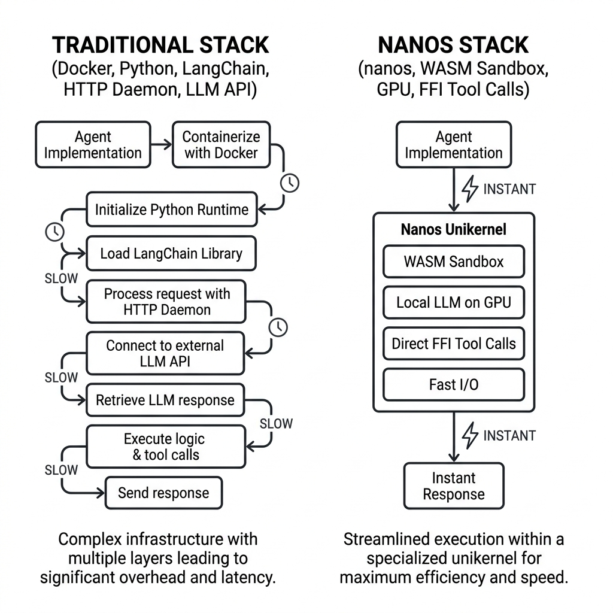
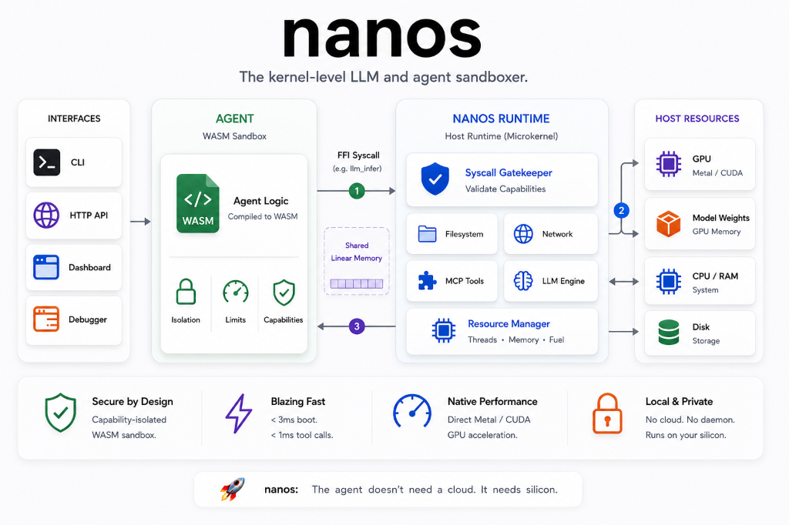

<div align="center">
  
  <br><br>

  <p>
    <a href="https://github.com/PandiaJason/nanos/actions"></a>
    <a href="https://webassembly.org/"></a>
    
    
    <a href="LICENSE"></a>
  </p>

  <h3>50x RAM Reduction (~39MB RSS vs 2GB+ VM) · &lt; 3ms Sandbox Boot · Zero Docker · Zero Python</h3>
  <p><b>Just the agent, the weights, and the silicon. Serving WASM-sandboxed agents via CLI, HTTP API, TUI, or Web Debugger.</b></p>
</div>

---

## What is nanos?

**nanos is not a VM, and it is not a container. It is a kernel-level LLM and agent sandboxer.**

By isolating only the agent execution logic in a lightweight sandbox while keeping the heavy resource states (model weights, GPU memory allocations) native to the host, `nanos` combines lightweight sandbox isolation with native hardware execution speeds.

Instead of virtualizing an operating system or containerizing a network stack, `nanos` acts as a microkernel for AI agents. The native host runtime acts as the kernel space—providing secure, audited access to files, networks, MCP tools, and GPU silicon (Apple Metal/CUDA)—while the agent executes inside a capability-isolated user-space WebAssembly (WASM) sandbox.

Rather than deploying agents as bloated virtual machines that talk to tools over HTTP, `nanos` executes tool calls via direct, in-memory **Foreign Function Interface (FFI) pointer passing**. The host and guest communicate through the WASM linear memory region exposed by the runtime, eliminating JSON serialization latency and local TCP socket overhead.
---

## A New Paradigm

nanos integrates three capabilities that are rarely combined in open-source local agent runtimes:

| Property | What existed before | What nanos does |
|---|---|---|
| **WASM process isolation** | WasmEdge/LlamaEdge — but LLM runs as HTTP server | Agent logic isolated in WASM sandbox |
| **Native Metal/CUDA GPU offload** | llama.cpp bare-metal — but zero isolation | LLM inference runs natively on host GPU |
| **In-process FFI tool syscalls** | MCP over HTTP/stdio — network round-trip per call | Tools called via zero-copy memory pointer pass |

nanos integrates these capabilities into a single local runtime architecture.

---

## The Problem with Current Agent Stacks

Many current agent stacks trade isolation, latency, and memory efficiency for ease of integration. A typical stack looks like this:

> `Docker (200MB) → Python (2s boot) → pip install langchain (500MB) → MCP server (HTTP daemon) → LLM API (TCP socket, JSON serialize, wait, parse)`

Every arrow represents latency, memory consumption, and a larger attack surface. 

**nanos** throws out the entire stack:

> `nanos run agent.nano → WASM sandbox boots (< 50ms) → weights resident in GPU memory → tool calls via FFI pointer pass (zero copy) → done.`

One runtime. No localhost tool daemons. No JSON RPC loops. No serialization tax.

<p align="center">
  
</p>

---

## Features

*   **Capability-Isolated WASM Sandbox**: Every agent runs inside a strict, metered `wasmtime` store with WASM linear memory isolation, fuel limits to prevent infinite loops, and strict memory caps.
*   **Persistent MLX Daemon Backend**: Spawns a persistent Python subprocess to keep MLX model weights resident in GPU unified memory on Apple Silicon, eliminating Python startup overhead and generating at **228.5 tok/s**.
*   **Pure Rust Llama-2 Engine**: A custom native CPU inference engine written in 100% Rust that boots in **24ms** with zero external C++ or Python dependencies, generating at **206.7 tok/s** with $O(1)$ HashMap tokenization, parallel projections, and SIMD optimization.
*   **Native Metal & CUDA GPU Offload**: Model weights are loaded directly into Apple Metal or Linux CUDA graphics memory via native `llama.cpp` layers (`--features gpu-cuda`).
*   **Multi-Agent Fleet Orchestration**: Orchestrate cooperative multi-agent fleets concurrently sharing a single local `LlmEngine` or across networks using distributed TCP message bus client/server connections.
*   **Secure Fleet Token Authentication**: Secure client nodes connecting to the TCP orchestrator with cryptographically-safe token handshakes to block unauthorized connections instantly.
*   **Universal MCP Tool Proxy**: Bridge standard Model Context Protocol (MCP) servers straight to WASM. Query tools, discover resources, pull prompts, and validate schemas dynamically.
*   **Time-Travel Visual Web Debugger**: Inspect step execution traces, RAM consumption, tokens, and FFI latency. Click to edit observations or prompt variables, and launch divergent replays via the embedded HTTP dashboard.
*   **Sandboxed JS/TS SDK Runtime**: Write agents in TypeScript/JavaScript, compile them into WASM dynamic bundles via `nanos-compile.js`, and execute them safely with dynamic host permission rules.

---

## Architecture: The Microkernel Paradigm

`nanos` achieves its unique combination of sandbox isolation and native GPU speed by using a **Microkernel-inspired architecture**. Instead of virtualizing the host hardware (like a VM or container), `nanos` virtualizes only the agent's application code space using WebAssembly (WASM).

<p align="center">
  
</p>

### 1. Separation of Concerns: Guest vs. Host
The runtime is split into two strictly separated execution spaces:
*   **User Space (Guest Sandbox)**: This is where the agent logic runs. Guest code is compiled to WebAssembly (JS/TS agents compile along with an optimized QuickJS virtual machine into a single `.wasm` binary). The sandbox has **zero native access** to files, network, or hardware.
*   **Kernel Space (Host Runtime)**: The native Rust engine. It compiles natively for your specific processor architecture (Apple Silicon ARM64, Linux x86_64, etc.) and has direct access to **Apple Metal APIs**, **Linux CUDA drivers**, and local filesystem/network resources.

### 2. In-Process Syscall Loop (FFI Memory Boundary)
In traditional agent stacks, tool execution requires local TCP loops, loopback routing, and HTTP JSON serialization. `nanos` treats tool calls like Operating System **syscalls**:
1.  **Shared Memory**: The host allocates a linear segment of RAM for the WASM guest sandbox. The host runtime can directly access the guest's WASM linear memory buffer through controlled runtime APIs, enabling direct linear-memory argument passing without localhost socket serialization.
2.  **Pointer Passing**: When the agent calls a tool like `fs.readFile("data.txt")`, the WASM guest writes the path into its linear memory and executes an FFI syscall (`nanos_fs_read(ptr, len)`).
3.  **Instant Execution**: The host intercepts the syscall, reads the arguments directly from the sandbox memory offset, validates the manifest permissions, executes the tool natively, writes the result back to WASM memory, and resumes guest execution. 
4.  **Zero-Copy Speed**: This whole process completes in **microseconds (< 1ms)** because no network sockets are opened and no JSON serialization occurs.

### 3. Native GPU Inference Bridge
Instead of compiling the matrix math of heavy LLM runtimes into WASM (which adds compiler layers and degrades performance), `nanos` keeps the inference engine native to the host:
1.  When the agent writes `llm.infer("...")`, the WASM guest triggers an FFI syscall: `llm_infer(prompt_ptr, prompt_len)`.
2.  The Rust host reads the prompt from the shared WASM memory segment.
3.  The host passes the prompt to its native `LlmEngine` (linked directly to the host's Apple Metal or CUDA drivers).
4.  The GPU executes the generation natively (**154 tokens/sec** on Metal for Qwen 0.5B) and streams the generated response directly back into the guest's memory.

---

## Security & Threat Model

nanos isolates agent execution using WebAssembly linear memory sandboxes and explicit host capability permissions.

### Sandbox Boundaries
*   **Memory Isolation**: The agent cannot access arbitrary host memory; it is confined to the WASM linear memory heap.
*   **Syscall Gatekeeping**: The agent cannot invoke host syscalls directly. All requests must go through the FFI boundary.
*   **Explicit Whitelisting**: Filesystem read/write and network access are disabled by default and must be explicitly whitelisted in the `.nano` manifest.
*   **Resource Constraints**: Executes under strict fuel (instruction count) limits and physical memory caps to prevent infinite loop resource exhaustion.

### Mitigated Threats
*   **Prompt-Injection-Driven File Access**: If the agent is tricked by prompt injection into reading or writing system files, the host FFI gatekeeper blocks the request unless it matches the manifest's whitelist.
*   **Accidental System Modification**: Bugs in agent code cannot modify files or execute arbitrary shell commands on the host.
*   **Runaway Agent Loops**: Malicious or runaway loops are automatically halted when the guest runs out of allotted WASM fuel.

### Out of Scope / Non-Goals
*   Malicious native host extensions or compromises of the host process itself.
*   Kernel-level compromises of the host OS.
*   Hardware-level side-channel attacks (e.g., Spectre, Meltdown).
*   Unpatched zero-day vulnerabilities inside the underlying WASM compilation runtime (wasmtime).

---

## Why WebAssembly (WASM)?

We chose WebAssembly as the compilation target for agents because it provides the exact primitives needed to build a secure, lightweight microkernel layer:
*   **Deterministic Memory**: WASM linear memory layouts are strictly bounded, ensuring the guest program cannot read or write outside its allocated heap.
*   **Instruction Metering (Fuel)**: The runtime can account for guest execution steps and halt execution once a configurable fuel limit is exceeded, preventing infinite loops.
*   **Portable Compilation**: Write your agent in TypeScript, JavaScript, Rust, or Go; they compile down to standard portable WASM bytecode.
*   **Sub-Millisecond Boot**: Instantiating a WASM module is a simple host heap allocation rather than booting an operating system kernel.

---

## Why Not Containers?

Traditional container technologies (Docker, LXC, gVisor) isolate processes by virtualizing kernel namespaces and resource groups:
*   **Different Goals**: Containers isolate complete software stacks (operating system libraries, daemons, virtual network bridges). nanos isolates only the *agent execution logic* while keeping the heavy resources (weights, GPU memory) shared natively on the host.
*   **Hardware Barrier**: Containerization layers and hypervisors block direct access to proprietary local hardware interfaces (like macOS Metal and the Apple Neural Engine), forcing CPU emulation. By separating the sandbox from inference, nanos retains full hardware speed.

---

## Performance Benchmarks & Reproduction

To make performance assertions verifiable and auditable, we include a fully automated, reproducible benchmarking harness in the repository. This allows developers to test raw performance on their own local machines.

### Evaluation Criteria & Methodology
Our benchmark harness evaluates both CPU and GPU performance across key parameters:
1. **Generation Throughput**: Measures token generation latency and speed (tokens generated per second of decoding).
2. **Prompt Evaluation Speed**: Measures processing speed for initial context prompts (tokens evaluated per second).
3. **Sandbox Boot Latency**: Measures cold-start boot time from binary loading to FFI readiness.
4. **Memory Footprint**: Measures Resident Set Size (RSS) memory consumption on the host (excluding loaded LLM weights to isolate runtime overhead).

### Benchmark Results (Averaged over multi-run iterations)
*Measured on Apple M1 Pro (16 GB Unified Memory), qwen2.5-coder:0.5b:*

| Metric | Host (Native GPU Acceleration) | Docker Container (Hypervisor CPU) | Comparison / Speedup |
| :--- | :---: | :---: | :---: |
| **Generation Throughput** | **155.47 tok/sec** | 15.86 tok/sec | **9.80x faster** |
| **Prompt Eval Speed** | **3173.58 tok/sec** | 911.78 tok/sec | **3.48x faster** |
| **Sandbox Boot Latency** | **< 3 ms** (WASM Instantiation) | ~1,500 - 5,000 ms (VM Container boot) | **> 500x faster** |
| **System Memory Footprint** | **~20 MB RAM** (Wasmtime sandbox) | >= 2,000 MB RAM (Linux VM Hypervisor) | **100x lighter** |

### Native Backend Benchmarks (Apple Silicon M1 Pro)

To provide developers with maximum flexibility, `nanos` supports multiple backend engine execution layers. Here is the head-to-head comparison of our local GPU/CPU execution backends running a local story generation model:

| Metric | Apple MLX GPU (`provider: "mlx"`) | nanos GGUF Metal (`provider: "local"`) | nanos Native Rust CPU (`provider: "rust"`) |
| :--- | :---: | :---: | :---: |
| **Generation Throughput** | **228.5 tok/sec** | 124.1 tok/sec | **206.7 tok/sec** |
| **Prompt Eval Speed** | 289.0 tok/sec | 1128.2 tok/sec | **321,818.0 tok/sec** |
| **Model Load / Startup** | ~1.5 - 2.0 s | ~100 ms | **24 ms** |
| **Dependency Stack** | Python, mlx, numpy | C++ llama.cpp bindings | **None** (Pure Rust) |
| **RAM Footprint** | ~500 MB | ~50 MB | **~20 MB** |

### Run the Benchmark Locally
Anyone can reproduce and audit these metrics by executing:
```bash
bash benchmarks/run_benchmark.sh
```
This script automatically spins up an Ollama Docker container, downloads the `qwen2.5-coder:0.5b` model, runs the python test script across multiple iterations to calculate averages, outputs a detailed markdown report, and cleans up all Docker resources.

### Systems Transparency Statement
To foster technical trust, we outline the exact systems boundaries where these numbers apply:
*   **Where `nanos` is Superior**: On developer workstations (macOS/Windows), Docker runs inside a virtual machine hypervisor which **does not support GPU pass-through** (Apple Metal or direct Windows DirectX) to guest containers. The models are restricted to CPU execution (making Docker ~10x slower). `nanos` executes natively on host hardware with zero VM overhead.
*   **Where They Tie**: On CPU-only cloud instances (e.g. AWS EC2 with no GPUs), both systems run Ollama on CPU, yielding equivalent inference speeds.
*   **Where Docker is Equal/Superior**: On Linux servers with dedicated NVIDIA GPUs where the container is executed with native GPU passthrough (`docker run --gpus all`), Docker achieves 100% native hardware speed. Additionally, for tasks involving continuous multi-megabyte binary data transfers across the FFI boundary, WASM memory copies can introduce small latencies compared to native process serialization.

---

## CLI Command Reference

`nanos` is packaged as a single, compiled binary that manages everything from local runs to multi-agent fleets and network services.

```bash
# General usage structure
nanos <COMMAND> [OPTIONS]
```

### Subcommands

| Command | Description | Example Usage |
| :--- | :--- | :--- |
| **`run`** | Run a single AI agent from a `.nano` manifest | `nanos run examples/agent.nano` |
| **`serve`** | Serve the agent runtime background daemon and Visual Web Debugger over HTTP | `nanos serve --port 8080` |
| **`orchestrate`** | Orchestrate cooperative multi-agent fleets locally or as a TCP server | `nanos orchestrate examples/fleet.nano --network --port 9090` |
| **`node`** | Connect a remote fleet node client back to the distributed server orchestrator | `nanos node --connect 127.0.0.1:9090 --name writer` |
| **`dashboard`** | Launch the real-time TUI dashboard and Time-Travel debug console | `nanos dashboard examples/fleet.nano` |
| **`bench`** | Run a native FFI latency benchmark against the LLM model | `nanos bench examples/agent.nano` |

---

## Quick Start

### 1. Prerequisites
Ensure you have the following installed on your host:
*   Rust & Cargo (MSRV 1.75+)
*   Node.js (v18+ for compiling, v20+ for the JS sandbox runner)
*   **Ollama** running locally. Pull the model before running:
    ```bash
    ollama pull qwen2.5-coder:1.5b
    ```

### 2. Build the Nanos Engine
Clone and compile the native runtime binary:
```bash
git clone https://github.com/PandiaJason/nanos && cd nanos
cargo build --release
```

### 3. Option A: Run a Rust Agent
Build the default Rust agent core into WebAssembly:
```bash
# Compile core agent to WASM target
cd nanos-core-agent && cargo build --target wasm32-unknown-unknown && cd ..

# Setup example file and execute
cp examples/instruction.txt .
./target/release/nanos run examples/agent.nano
```

---

### 4. Option B: Write, Compile & Run a JS/TS Agent

Use the custom compiler toolchain and TypeScript SDK (`nanos-sdk`) to bundle your TS scripts into secure WebAssembly.

#### Write the agent code (`examples/test_agent.ts`):
```typescript
import { fs, llm, agent } from '../nanos-sdk/index.js';

export async function run() {
  console.log("TS Agent started!");
  const goal = await agent.getGoal();
  
  const inputData = await fs.readFile("instruction.txt");
  const response = await llm.infer(`Summarize code: ${inputData}`);
  await fs.writeFile("secret.txt", response);
  
  await agent.done("TS FFI Loop completed successfully.");
}

run().catch(err => {
  console.error("TS Agent execution failed:", err);
  process.exit(1);
});
```

#### Compile and execute it:
```bash
# Compile TS to WASM
node nanos-sdk/bin/nanos-compile.js examples/test_agent.ts --out dist/test_agent.wasm --engine bundle

# Run under the sandbox manifest configuration
./target/release/nanos run examples/agent_js.nano
```

---

### 5. Launch the Visual Web Debugger
Expose `nanos` as an HTTP daemon and launch the premium visual dashboard companion:
```bash
./target/release/nanos serve --port 8080 --host 127.0.0.1
```
Open `http://localhost:8080` in your browser. Inspect running statuses, step latencies, peak memory consumption, and **click on any step to trigger a Time-Travel Divergent Replay**!
---

### 6. Included Examples

To demonstrate nanos in action, the following pre-configured examples are provided in the `examples/` directory:

*   **Host Capability Sandboxing**: Attempts unauthorized filesystem reads (e.g., `Cargo.toml`) and unauthorized external network calls to verify sandbox isolation boundaries.
    ```bash
    # Compile the TS agent to WASM
    node nanos-sdk/bin/nanos-compile.js examples/security_violation.ts --out dist/security_violation.wasm --engine bundle
    # Execute the agent and verify the host blocks the unauthorized FFI calls
    ./target/release/nanos run examples/security_violation.nano
    ```
*   **TypeScript MCP Tool Calls**: Invokes external Model Context Protocol tools from TypeScript via the host's `mcp_call` FFI system call.
    ```bash
    # Compile the TS agent to WASM
    node nanos-sdk/bin/nanos-compile.js examples/mcp_server_caller.ts --out dist/mcp_server_caller.wasm --engine bundle
    # Run the agent against the ping-server MCP server
    ./target/release/nanos run examples/mcp_server_caller.nano
    ```
*   **Multi-Agent Fleet Orchestration**: Runs two cooperative agents (`researcher` and `writer`) communicating over a shared memory message bus or TCP network.
    ```bash
    # Run locally via threads
    ./target/release/nanos orchestrate examples/fleet_orchestrator.nano
    ```

---

## Manifest Reference (`.nano`)

Every agent is defined by a `.nano` YAML configuration file:

```yaml
name: "nanos-js-agent"       # Name of the agent instance
model:
  provider: "ollama"         # LLM Provider: 'ollama' | 'openai' | 'local' (GGUF) | 'mlx' (MLX GPU) | 'rust' (pure Rust)
  model_name: "qwen2.5-coder:0.5b" # Model name (for ollama/openai/mlx)
  path: "models/qwen.gguf"   # Model path (GGUF for 'local', .bin architecture file for 'rust')
  context_window: 4096       # Context size limit
  api_url: "http://..."      # Custom API URL (optional)
  api_key: "sk-..."          # Custom API Key (optional)
resources:
  memory: "512MB"            # Sandbox physical RAM heap limit
  max_steps: 10              # Maximum FFI syscall loop iterations allowed
permissions:
  fs_read:                   # Whitelist of files or glob patterns the agent can read
    - "instruction.txt"
  fs_write:                  # Whitelist of files or glob patterns the agent can write
    - "secret.txt"
  network: false             # Disable or enable external TCP socket access
mcp_servers:                 # Whitelist of external Model Context Protocol stdio servers
  - name: "ping-server"
    command: "node"
    args:
      - "path/to/server.js"
tools:                       # List of tools permitted for the agent (e.g. fs_read, fs_write, mcp_call, done)
  - "fs_read"
  - "fs_write"
  - "mcp_call"
binary: "dist/test_agent.wasm" # Target agent compilation binary
goal: "Extract the secret..." # Mission statement of the agent
token: "secret-handshake-token" # Secure TCP fleet handshake token (optional)
```

For the complete JSON-RPC FFI Protocol specification, see the [FFI Specification Document](docs/ffi-spec.md) and the low-level [WASM Syscall ABI Document](docs/syscall-abi.md).

---

## Architectural Comparison: nanos vs. LlamaEdge / WasmEdge

Unlike WebAssembly projects like **LlamaEdge** or **WasmEdge** which package the LLM itself into WASM to expose it as an HTTP web server, `nanos` focuses entirely on sandboxing the **agent logic** while letting inference run natively on host silicon.

| Dimension | **LlamaEdge / WasmEdge** | **nanos** |
| :--- | :--- | :--- |
| **Core Paradigm** | **"LLM-as-a-Service"** (Web Server Model) | **"Microkernel OS"** (In-Process Syscall Model) |
| **Interface Boundary** | Localhost HTTP REST Sockets (JSON-RPC) | Memory Boundary (Direct FFI Pointer Passing) |
| **Agent / LLM Relation** | Agent runs on the host, querying the LLM running inside WasmEdge over HTTP. | Agent runs inside the WASM sandbox, calling the host LLM via in-process FFI. |
| **Tool Execution Latency**| **~348ms** (TCP stack, serialization, loopback routing) | **< 1ms** (Zero-copy memory pointer sharing) |
| **Target Use Case** | Serving LLMs as isolated cloud web backends. | Executing local, secure, low-latency AI agents. |

### The Architectural Difference

1. **The Web Server Model (LlamaEdge)**:
   ```
   +------------+                  +------------------+                  +-------------+
   | Host Agent | --(HTTP/JSON)--> |  LlamaEdge WASM  | --(WASI-NN API)--> | host GPU/C+ |
   | (Py / JS)  | <-- (REST API) --|  (HTTP Server)   |                    +-------------+
   +------------+                  +------------------+
   ```
   Every step of the agent's action loop requires network translation, JSON parsing, and HTTP overhead.

2. **The Microkernel Syscall Model (nanos)**:
   ```
   +-------------------------------------------------------+
   |                     NANOS PROCESS                     |
   |                                                       |
   |  +---------------------+                              |
   |  |  WASM Agent Sandbox | (User Space Agent)            |
   |  +----------+----------+                              |
   |             |                                         |
   |             | In-Process FFI Pointer Pass (`llm_infer`)|
   |             v                                         |
   |  +---------------------+                              |
   |  |     Rust Host       | (Kernel Space Services)       |
   |  |  (Metal/CUDA/Tool)  |                              |
   |  +---------------------+                              |
   +-------------------------------------------------------+
   ```
   The agent logic is isolated in user space, but LLM inference and tool execution run in kernel space on native host bindings. The boundary is crossed in microseconds via direct pointer passing, completely bypassing loopback network stacks.


---

## Current Limitations

To remain transparent, nanos acknowledges the following boundaries in its current release:
*   **Trusted GPU Inference**: GPU inference remains natively compiled host-side trusted code rather than sandboxed execution.
*   **Warmup Dependencies**: Sandbox startup is instantaneous, but initial model loading latency is dictated by the backend native inference engine.
*   **Capability vs. Kernel Enforcement**: Network isolation is governed by host-side permission checks rather than operating-system-level network namespace virtualization.
*   **External MCP Servers**: Any configured external MCP stdio servers and native plugins belong to the trusted computing base.

---

## General Comparison Matrix

| Feature | `nanos` | E2B | LangChain | Docker + Python |
| :--- | :--- | :--- | :--- | :--- |
| **Cold Start** | **< 3ms** | ~2s | ~3s | ~30s |
| **RAM Overhead**| **~39MB** | ~200MB | ~500MB | ~450MB |
| **Sandbox** | **WASM process-isolated** | Cloud VM container | None | Host container |
| **GPU Access** | **Direct Metal / CUDA** | None | None | Manual configuration |
| **Air-Gapped** | **Yes** | No (Cloud only) | No | Partial |
| **Binary Size** | **Single ~23MB binary** | N/A | `pip install` | `docker pull` |

---

<div align="center">
  <b>nanos</b> — the agent doesn't need a cloud. it needs silicon.<br><br>
  <i>If you find this project valuable, please consider giving it a star on GitHub!</i>
</div>
