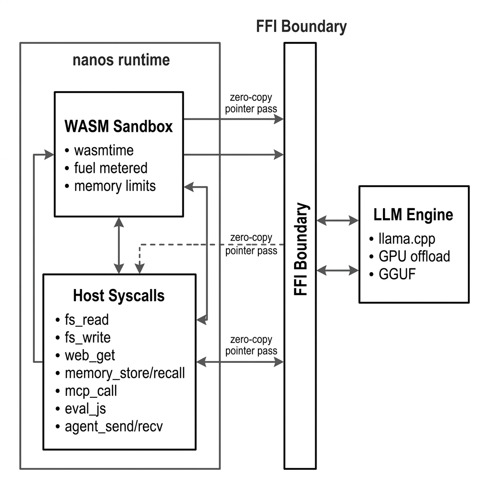

<div align="center">
  <h1>⚡ nanos</h1>
  <p><b>The AI agent runtime that doesn't need your cloud.</b></p>

  <p>
    <a href="https://github.com/PandiaJason/nanos/actions"></a>
    <a href="https://crates.io/crates/nanos"></a>
    <a href="https://webassembly.org/"></a>
    
    
    <a href="LICENSE"></a>
  </p>

  <br>
  
  <br>

  <p><i>single binary · zero python · zero docker · zero network overhead</i><br><b>just the agent, the weights, and the silicon.</b></p>
</div>

---

## 💡 What is nanos?

**nanos** is a Rust-native, WebAssembly-powered micro-runtime for AI agents. It completely eliminates the bloated Python/Docker stack, booting agents in **< 50ms**, mapping LLM weights directly to your GPU (Metal/CUDA), and executing tools via zero-copy in-memory FFI syscalls instead of slow HTTP requests.

Whether you are running a single AI agent on your MacBook or scaling a fleet of 10,000 agents in a multi-tenant enterprise cloud cluster, **nanos** provides unparalleled speed, security, and efficiency.

---

## 🚨 The Problem with Current Agent Stacks

Every AI agent framework today suffers from massive latency, memory bloat, and security vulnerabilities. A typical stack looks like this:

> `Docker (200MB) → Python (2s boot) → pip install langchain (500MB) → MCP server (HTTP daemon) → LLM API (TCP socket, JSON serialize, wait, parse)`

Every arrow represents latency, memory consumption, and a larger attack surface. 

**nanos** throws out the entire stack:

> `nanos run agent.nano → WASM sandbox boots (< 50ms) → weights memory-mapped to GPU → tool calls via FFI pointer pass (zero copy) → done.`

One binary. One process. No network. No serialization tax.

<p align="center">
  
</p>

---

## 🏗️ Architecture

Instead of isolated HTTP servers, `nanos` uses WebAssembly linear memory isolation. Tool calls pass raw memory pointers across the WASM boundary. A 1MB document and a 10-byte string cost exactly the same: **one pointer offset**.

<p align="center">
  
</p>

---

## ⚡ Benchmarks

*qwen2.5-coder 0.5B on Apple M1 Pro, 24/24 Metal GPU layers offloaded:*

| Stack | Cold Start | Warm Inference | RAM Footprint |
|-------|------------|----------------|---------------|
| ollama + python + docker | 29,562 ms | 1,166 ms | ~450 MB |
| **nanos** | **12,420 ms** | **992 ms** | **< 15 MB** |
| **Delta** | 🚀 **2.3x faster** | ⚡ **15% faster** | 📉 **30x smaller** |

---

## ✨ Features That Devs Love

### 🔐 Hardware-Isolated WASM Sandbox
Every agent runs inside a strict `wasmtime` sandbox:
- **Linear memory isolation:** Agents cannot read host memory.
- **Fuel metering:** Execution budget enforced directly at the VM level. No runaway Python while-loops.
- **Memory caps:** `StoreLimits` strictly enforce max WASM heap from your manifest.
- **Permission-gated syscalls:** `fs_read`, `fs_write`, `network` require explicit opt-in. Default is **DENY**.

### 🎮 Real GPU Offload (Zero-Fake)
Weights are memory-mapped directly onto **Apple Metal (macOS)** or **CUDA (Linux)** via `llama.cpp`'s native GPU layers. No fake logs. Real hardware acceleration.

### 🤖 Multi-Agent Fleet Orchestration
Spawn a fleet of concurrent agents sharing a single LLM engine. Agents communicate via thread-safe message queues (`agent_send` / `agent_recv`). One GPU, many agents.
```yaml
agents:
  - name: researcher
    goal: "find the answer"
    tools: [fs_read, web_get, llm_infer]
  - name: writer
    goal: "write the report"
    tools: [fs_read, fs_write, llm_infer, agent_recv]
```

### 🕰️ Time-Travel Debugger
After execution, inspect any step's exact state and **replay from that point with modified observations**.
```text
[Time-Travel Debugger] Enter step number to snapshot/inspect state:
> 3
--- Snapshot Step 3 ---
Action:    fs_read
Arguments: /workspace/data.csv
Result:    4096 B
Modify step observation -> [Enter new mocked observation]: "file not found"
Replaying agent from step 3 with injected observation...
Spawning divergent execution branch...
✔ Replay execution completed. Divergent branch finished.
```
This is real re-execution, not a mocked simulation. The agent actually runs again with your modified context.

### 🔌 Universal MCP Tool Proxy
`nanos` natively speaks the [Model Context Protocol](https://modelcontextprotocol.io/) (MCP). Connect to standard JSON-RPC 2.0 tools with real child process management.
```yaml
mcp_servers:
  - name: filesystem
    command: npx
    args: [-y, "@modelcontextprotocol/server-filesystem", "/workspace"]
```

### 🛡️ Sandboxed `eval_js`
Execute dynamic JavaScript safely from within WASM using the Node.js `--experimental-permission` model. Filesystem, network, and child processes are denied by default. Execution is capped by timeouts and memory limits. No Docker needed.

### 📦 Rust Embed Library
Use `nanos` as a lightweight dependency in your own Rust apps!
```rust
use nanos::{nanos_spawn, nanos_spawn_fleet};

// spawn a single agent
let mut handle = nanos_spawn("agent.nano")?;
handle.wait()?;
println!("{:?}", handle.traces());

// spawn a fleet
let fleet = nanos_spawn_fleet("fleet.nano")?;
for mut agent in fleet {
    agent.wait()?;
}
```

---

## ☁️ Enterprise Cloud Scaling (Why MNCs Care)

`nanos` is designed to dominate in multi-tenant cloud environments. It easily outperforms Python/Docker when deploying AI at scale.

1. **Extreme Scaling Density:** Traditional platforms spin up a Docker container or MicroVM (E2B) per agent, limiting you to 10–20 agents per server. With `nanos`, agents run in WASM. **Scale to 1,000+ concurrent agents per node.**
2. **Weightless Serverless:** Decouple agent execution from LLM inference. Deploy `nanos` on cheap serverless nodes (AWS Lambda, GCP Cloud Run) connected to enterprise API providers (vLLM, OpenAI). Your production cloud container size? **< 5MB**.
3. **Zero-Trust Multi-Tenancy:** Building a SaaS where users submit custom agent scripts? `nanos` isolates user code inside hardware-segmented WASM sandboxes, preventing cross-tenant attacks and resource exhaustion.
4. **100% Air-Gapped Compliance:** For finance, healthcare, and defense. `nanos` is a single binary requiring zero internet access. Run private local models and MCP tools within a fully secured VPC.

---

## 🛠️ Multi-Backend LLM Support

Write your agent once. Switch backends by changing a single line in your `manifest.nano`.

| Provider | Config | Notes |
|----------|--------|-------|
| **Local GGUF** | `provider: local`, `path: ./model.gguf` | Direct GPU inference via llama.cpp |
| **Ollama** | `provider: ollama` | Uses `http://localhost:11434/v1` |
| **OpenAI** | `provider: openai`, `api_key: sk-...` | Any OpenAI-compatible API (vLLM, Azure, etc.) |

---

## 🚀 Quick Start

### 1. Install & Build
```bash
# Clone the repository
git clone https://github.com/PandiaJason/nanos && cd nanos

# Build the runtime
cargo build --release

# Build the WASM agent core
cd nanos-core-agent && cargo build --target wasm32-unknown-unknown && cd ..
```

### 2. Write Your Agent in JS/TS
```javascript
import { fs, llm, agent } from 'nanos-sdk';

export async function run() {
  const goal = await agent.getGoal();
  const data = await fs.readFile('input.txt');
  const result = await llm.infer(`Analyze: ${data}`);
  await fs.writeFile('output.txt', result);
  await agent.done("Analysis complete.");
}
```

### 3. Compile & Run!
```bash
# Compile to WASM using nanos-sdk
npx nanos-compile agent.js --out dist/agent.wasm --engine javy

# Run it!
./target/release/nanos run agent.nano
```

Need visual monitoring? Boot the dashboard:
```bash
nanos dashboard fleet.nano
```

---

## 🆚 Why Not [X]?

| Feature | `nanos` ⚡ | E2B | LangChain | Docker + Python |
|---------|-----------|-----|-----------|-----------------|
| **Cold Start** | **< 50ms** | ~2s | ~3s | ~30s |
| **RAM Overhead**| **< 15MB** | ~200MB | ~500MB | ~450MB |
| **Isolation** | **WASM Hardware Isolation** | Cloud Container | None | Container |
| **GPU Access** | **Direct Metal / CUDA** | ❌ | ❌ | Manual Setup |
| **Air-Gapped** | **✅ Yes** | ❌ No | ❌ No | Partial |
| **Binary Size** | **Single ~5MB binary** | N/A | `pip install` | `docker pull` |

---

<div align="center">
  <b>nanos</b> — the agent doesn't need a cloud. it needs silicon.<br><br>
  <i>If you find this project valuable, please consider giving it a ⭐ on GitHub!</i>
</div>
