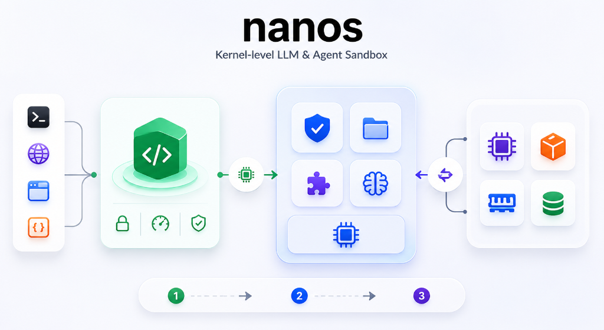

# Nanos Architecture: A Technical Deep-Dive

  

`nanos` is fundamentally a minimalist operating system designed specifically for autonomous AI agents. Unlike standard environments which rely on heavy containerization (Docker) and interpreted languages (Python), `nanos` is written in Rust and utilizes WebAssembly (WASM) for execution isolation and `llama.cpp` for native neural processing.

## 1. The Kernel (Host Engine)
The core `nanos` binary acts as the kernel. It is responsible for parsing the `agent.nano` manifest, allocating memory, handling hardware access, and enforcing security boundaries.

### Wasmtime Engine
We use `wasmtime::Engine` without the overhead of the Component Model. This provides raw, core WebAssembly execution. 
The agent's state is injected via an `AgentState` struct passed into the `wasmtime::Store`. This `AgentState` holds a mutable reference to the underlying LLM engine, bridging the gap between the isolated sandbox and the neural weights without network serialization.

## 2. The Neural Co-Processor
We bypass HTTP servers like Ollama entirely by binding directly to the C++ inference engine using the `llama-cpp-sys-2` crate.
When `nanos` boots, it detects the underlying hardware (e.g., Apple Silicon) and memory-maps GGUF weights directly into the GPU (Metal MTL0).
Inference occurs via a native Rust autoregressive decoding loop allocating a `LlamaContext` and streaming tokens to completion. 

## 3. The Process Boundary (WASM)
Agent logic is compiled to `wasm32-unknown-unknown` and loaded into linear memory. The hardware-level isolation of WASM means the agent has absolutely zero access to the host machine unless explicitly granted.
Instead of sending JSON strings over TCP sockets, `nanos` uses zero-copy data transfer. Memory pointers (`i32` offsets) are passed across the boundary, drastically minimizing latency.

## 4. The Syscall ABI
Host functions are wrapped and exposed to the WASM sandbox as syscalls. These include:
- `fs_read(path_ptr, path_len, out_buf, out_buf_len) -> i32`
- `web_get(url_ptr, url_len, out_buf, out_buf_len) -> i32`
- `llm_infer(prompt_ptr, prompt_len, out_buf, out_buf_len) -> i32`

Syscalls are intercepted by the Rust host, cross-referenced against the security rails defined in the `agent.nano` manifest, and executed natively.

## 5. Continuous Batching (MPSC)
To scale `nanos` for production, the host architecture utilizes Multi-Producer Single-Consumer (MPSC) channels. Multiple isolated WASM agents can execute concurrently in background threads, dispatching their inference requests via channels to a centralized LLM scheduler thread. This ensures that the GPU remains fully saturated and memory bandwidth is maximized.
